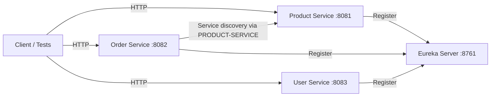

# E-commerce Microservices

This repository contains the Phase 1 implementation of an e-commerce microservice platform built with Java 21, Spring Boot, Spring Cloud, MySQL, and Maven.

## Phase 1 implemented

- Eureka Server
- Product Service
- Order Service
- User Service
- MySQL datasource configuration per service
- Service registration with Eureka
- Order-to-Product service discovery over the logical service name `PRODUCT-SERVICE`

## Spring compatibility

This project uses:

- Spring Boot 3.4.5
- Spring Cloud 2024.0.0
- Java 21 compilation target

This is the verified compatible Spring Boot/Spring Cloud pair for this environment. The runtime JDK in the workspace is Java 26, but compiling to Java 21 avoids the ASM class-format issue while keeping the application stack aligned with the supported Spring compatibility matrix.

## Architecture

## Services

### Eureka Server
- Port: 8761
- `@EnableEurekaServer`
- No client registration

### Product Service
- Port: 8081
- Application name: `product-service`
- Own database: `product_db`

### Order Service
- Port: 8082
- Application name: `order-service`
- Own database: `order_db`
- Resolves Product Service by logical name `PRODUCT-SERVICE` through Eureka

### User Service
- Port: 8083
- Application name: `user-service`
- Own database: `user_db`

## Local development

1. Start MySQL in Docker or local installation.
2. Create databases: `product_db`, `order_db`, `user_db`.
3. Start Eureka Server.
4. Start the three services.
5. Use `mvn test` in each microservice for verification.

## Phase 2 is intentionally not started

The project is stopped after Phase 1 as requested.
